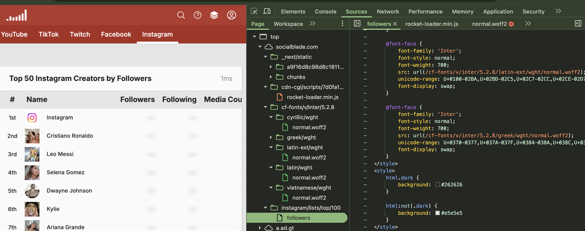
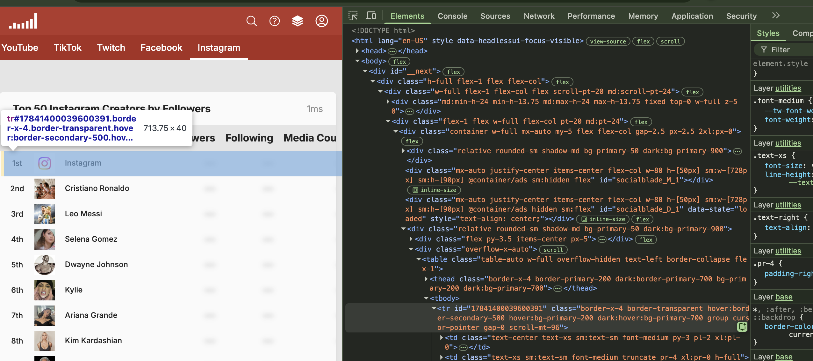
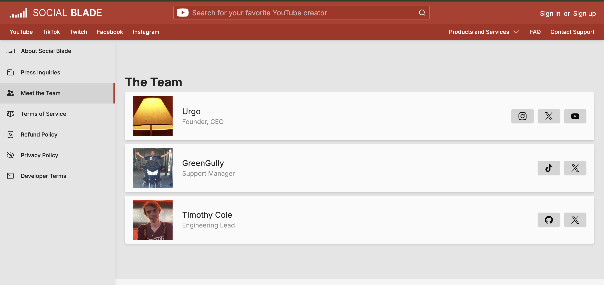

# Assignment 1: Inspecting the Cultural Web

The website I chose to investigate for this assignment was SocialBlade's top 100 instagram accounts. I was curious to see where the data was coming from, and how they were able to display it on their website.

Link: https://socialblade.com/instagram/lists/top/100/followers

The frontend of the site displays data using a mix of HTML, CSS, and JS.

You can see in the filetree here that it has _next/static files, which comes from Next.js which is a library that is helpful for managing api calls to pull and display site data. Next.js works with React.js to display data. Socialblade likely uses the React framework to create and manage the HTML and systematically apply CSS to loaded elements.

Here, we can see that for ourselfs using the inspect element tool. I'm hovering over one of the rows here, which is the Instagram row (the top account). In the side panel, you can see in the HTML where the site has constructed this object. While it appears in the HTML. Each of the rows is created systematically using that tool rather than by hand, allowing the website to sync with data it gets from various platforms, in this case Instagram.

The Socialblade team is three people, and I know this because they have an about the team page. 

Link: https://socialblade.com/info/team

Furthermore, I was able to find the official github page for Socialblade, which is managed by those team members.

Link: https://github.com/socialblade

In their Github, they have a repo with an API linked to socialblade, so that anyone can fetch data from their site and use it for their own purposes.